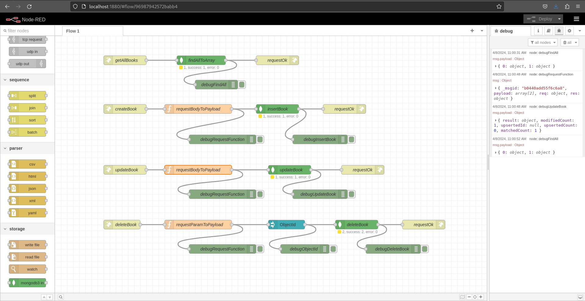

# Node-RED CRUD Example

## Prerequisites

* Npm
* Mongo DB
* Docker

## How to run

Just do a **docker compose up** and go to http://localhost:1880/ on your browser. It is just that simple.

## Overview

