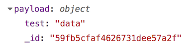

# node-red-contrib-objectid

This Node-Red node is to create an Object-Id for mongodb write operations from JSON inputs.

The selected property in `msg.payload` or in Array-Objects will be set to a BSON-Object-Id, 
you can also inject a 24 hex characters and the node creates 
a valid Object-Id property from it or raise an error if it is not valid.

For example: 

`msg.payload._id = "572dbc06f307c8682045c55c"`

or 

`msg.payload.uuid = "572dbc06f307c8682045c55c"`

If the target property is not to find or empty, then a random Object-Id is created.

## Test flows

[Flow example][1]

## Config

## Examples

## License:
__MIT:__
THE SOFTWARE IS PROVIDED "AS IS", WITHOUT WARRANTY OF ANY KIND, EXPRESS OR IMPLIED, INCLUDING BUT NOT LIMITED TO THE WARRANTIES OF MERCHANTABILITY, FITNESS FOR A PARTICULAR PURPOSE AND NONINFRINGEMENT. IN NO EVENT SHALL THE AUTHORS OR COPYRIGHT HOLDERS BE LIABLE FOR ANY CLAIM, DAMAGES OR OTHER LIABILITY, WHETHER IN AN ACTION OF CONTRACT, TORT OR OTHERWISE, ARISING FROM, OUT OF OR IN CONNECTION WITH THE SOFTWARE OR THE USE OR OTHER DEALINGS IN THE SOFTWARE.

[1]:https://flows.nodered.org/flow/fd92765c02efd19453927e992bb1349c
